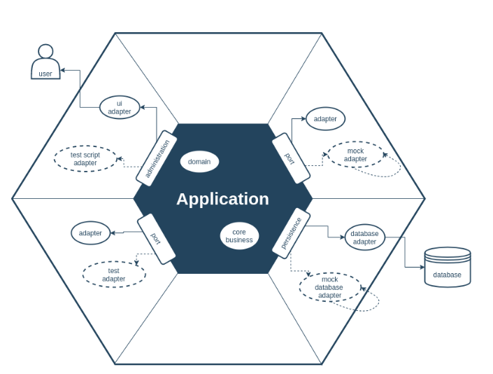

  

"# hexagonal-architecture" 

Product Management System - Hexagonal Architecture (.NET 9)
Este proyecto implementa una solución de gestión de productos utilizando Arquitectura Hexagonal (Puertos y Adaptadores) en .NET 9. El objetivo principal es desacoplar la lógica de negocio de las tecnologías externas (bases de datos, frameworks de UI, archivos), facilitando la testabilidad y el mantenimiento a largo plazo.

🏗️ Estructura de la Solución
La solución está dividida en componentes que representan las capas del hexágono:

1. Core (El interior del Hexágono)
DomainComponent: Contiene las entidades de negocio, reglas de dominio y las definiciones de los Puertos (interfaces). Es el corazón del sistema y no tiene dependencias externas.

ApplicationComponent: Implementa los servicios de aplicación y la lógica de orquestación. Coordina el flujo de datos entre los puertos.

2. Infrastructure (Adaptadores de Salida)
ApplicationRepositoryComponent: Implementa los adaptadores para la persistencia. Aquí se encuentran las implementaciones concretas para manejar ficheros JSON y XML.

3. Drivers (Adaptadores de Entrada)
InfrastuctureApiAppComponent: Una Web API que actúa como punto de entrada para clientes web/móviles. Incluye soporte para OpenAPI (Swagger/Scalar).

InfrastuctureConsoleAppComponent: Aplicación de consola que permite interactuar con el dominio de forma directa, demostrando la versatilidad de la arquitectura.

🚀 Tecnologías Utilizadas
Framework: .NET 9

API Documentation: Microsoft.AspNetCore.OpenApi + Swashbuckle / Scalar.

Dependency Injection: Keyed Services (Servicios con clave) para alternar entre repositorios JSON y XML.

Formatos de datos: Soporte nativo para persistencia en archivos físicos.

🛠️ Configuración y Ejecución
Requisitos
SDK de .NET 9.0

Visual Studio 2022 (v17.14+) o VS Code.

Instalación
Clona el repositorio:

Restaura las dependencias:

Ejecución de la API
Para levantar el servidor y probar los endpoints (JSON/XML) a través de Swagger:

La interfaz de documentación se abrirá automáticamente en la raíz (gracias a la configuración de RoutePrefix).

🧪 Características Destacadas (Senior Level)
Keyed Services: Implementación de múltiples repositorios para un mismo puerto, seleccionables en tiempo de ejecución mediante inyección de dependencias con clave ([FromKeyedServices]).

Desacoplamiento Total: Los cambios en el formato de archivo (JSON a XML) no afectan a la lógica de negocio ni a los controladores de la API.

OpenAPI 3.1: Configuración avanzada de documentación para diferenciar los grupos de endpoints por tipo de persistencia.

📄 Licencia
Este proyecto está bajo la licencia MIT.
